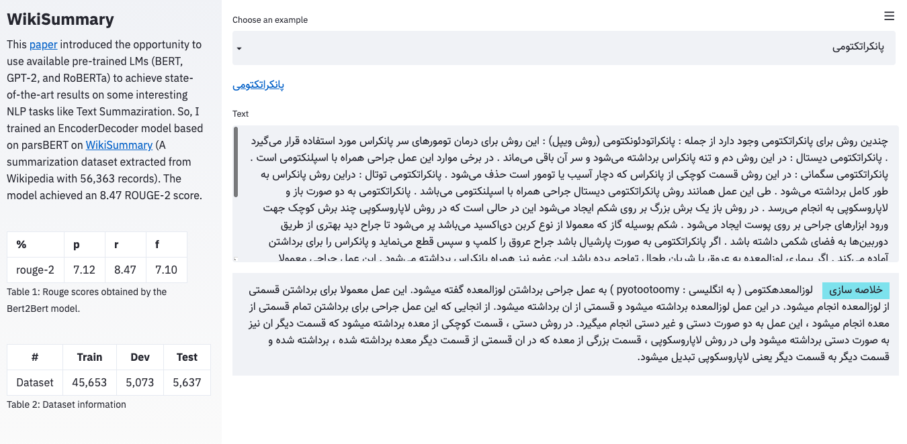

# Wiki Summary

This [paper](https://arxiv.org/abs/1907.12461) introduced the opportunity to use available pre-trained LMs (BERT, GPT-2, and RoBERTa) to achieve state-of-the-art results on some interesting NLP tasks like Text Summaziration.
So, I trained an EncoderDecoder model based on parsBERT on [WikiSummary](http://github.com/m3hrdadfi/wiki-summary) (A summarization dataset extracted from Wikipedia with 56,363 records).
The model achieved an 8.47 ROUGE-2 score.

[](https://youtu.be/sBEIcP9Eipo)

## Dataset information
The dataset extracted from Persian Wikipedia into the form of articles and summaries. I cleaned the dataset into pairs of articles and highlights and reduced the articles' length and highlights' length to a maximum of 512 and 128, respectively, suitable for parsBERT. 
Also, for making things simple, converted the dataset into the [HuggingFace' datasets](https://github.com/m3hrdadfi/wiki-summary/tree/master/datasets), which is available in the [repo](https://github.com/m3hrdadfi/wiki-summary/tree/master/datasets). 
Or you can access the `csv` format here:

- [Train Set](https://drive.google.com/uc?id=)
- [Dev Set](https://drive.google.com/uc?id=)
- [Test Set](https://drive.google.com/uc?id=)


|    #    |  Train |  Dev  |  Test |
|:-------:|:------:|:-----:|:-----:|
| Dataset | 45,653 | 5,073 | 5,637 |

## Evaluation
The following table summarizes the ROUGE scores obtained by the Bert2Bert model.

|    %    | Precision | Recall | FMeasure |
|:-------:|:---------:|:------:|:--------:|
| ROUGE-1 |   28.14   |  30.86 |   27.34  |
| ROUGE-2 |   07.12   | 08.47* |   07.10  |
| ROUGE-L |   28.49   |  25.87 |   25.50  |

## How to use

### HuggingFace Transformers
```python
from transformers import (
    BertTokenizerFast,
    EncoderDecoderConfig,
    EncoderDecoderModel
)

model_name = 'm3hrdadfi/bert2bert-fa-wiki-summary'
tokenizer = BertTokenizerFast.from_pretrained(model_name)
config = EncoderDecoderConfig.from_pretrained(model_name)
model = EncoderDecoderModel.from_pretrained(model_name, config=config)

sequence = """YOUR TEXT COMES HERE"""
inputs = tokenizer([sequence], padding="max_length", truncation=True, max_length=512, return_tensors="pt")
input_ids = inputs.input_ids
attention_mask = inputs.attention_mask

outputs = model.generate(input_ids, attention_mask=attention_mask)
generated = tokenizer.batch_decode(outputs, skip_special_tokens=True)
print(f'YOUR GENERATED TEXT: {generated}')
```

### Streamlit Application on Google-Colab
Follow the block steps on this Colab notebook.

[](https://colab.research.google.com/github/m3hrdadfi/wiki-summary/blob/master/notebooks/How_to_use_app.ipynb) 

## Cite 
I didn't publish any paper about this work. Please cite this repository in publications as the following:

```markdown
@misc{Bert2BertFaWikiSummary,
  author = {Mehrdad Farahani},
  title = {Summarization using Bert2Bert model on WikiSummary dataset},
  year = {2020},
  publisher = {GitHub},
  journal = {GitHub repository},
  howpublished = {https://github.com/m3hrdadfi/wiki-summary},
}
```

## Releases
v1: Hello World!

Available by: [m3hrdadfi/bert2bert-fa-wiki-summary](https://huggingface.co/m3hrdadfi/bert2bert-fa-wiki-summary)


## License
[Apache License 2.0](LICENSE)
